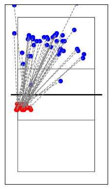

# pydatavolley

A python package for reading volleyball scouting files in DataVolley
format (\*.dvw).

<https://pypi.org/project/pydatavolley/>

### Installation[^1]

    pip install pydatavolley
    pip install --upgrade pydatavolley

## <u>Examples</u>

#### Reading one file:

``` python
# Using read_dv.DataVolley(None) will use example file
import pandas as pd
from datavolley import read_dv
pd.set_option('display.max_rows', 50)
pd.set_option('display.max_columns', 500)
pd.set_option('display.width', 400)
dv_instance = read_dv.DataVolley(None)
df = dv_instance.get_plays()
print(df[588:618])
```

                                     match_id video_file_number video_time                code                      team player_number      player_name player_id      skill evaluation_code setter_position attack_code set_code set_type start_zone end_zone end_subzone num_players_numeric  home_team_score  visiting_team_score home_setter_position visiting_setter_position custom_code home_p1 home_p2  \
    588  75347352-e5ca-4f4c-940d-b2bbe528d7dd                 1       2231   a10SM-~~~17A~~~+2      University of Dayton            10   Jamie Peterson    -11802      Serve               -               3         NaN      NaN      NaN          1        7           A                 NaN                5                    6                    5                        3          +2      11      15   
    589  75347352-e5ca-4f4c-940d-b2bbe528d7dd                 1       2232  *10RM#~~~17AW~~-2F  University of Louisville            10      Mel McHenry    -75967  Reception               #               5         NaN      NaN      NaN          1        7           A                 NaN                5                    6                    5                        3         -2F      11      15   
    590  75347352-e5ca-4f4c-940d-b2bbe528d7dd                 1       2233   *19EQ#K1C~3B~~~-2  University of Louisville            19  Shannon Shields   -296094        Set               #               5         NaN       K1        C        NaN        3           B                 NaN                5                    6                    5                        3          -2      11      15   
    591  75347352-e5ca-4f4c-940d-b2bbe528d7dd                 1       2234  *07AQ-X1~37AT2~-2F  University of Louisville             7      Emily Scott   -224837     Attack               -               5          X1      NaN      NaN          3        7           A                   2                5                    6                    5                        3         -2F      11      15   
    592  75347352-e5ca-4f4c-940d-b2bbe528d7dd                 1       2234  a02DQ+~~~37AS~~+2B      University of Dayton             2    Maura Collins   -230138        Dig               +               3         NaN      NaN      NaN          3        7           A                 NaN                5                    6                    5                        3         +2B      11      15   
    593  75347352-e5ca-4f4c-940d-b2bbe528d7dd                 1       2236   a08ET#K1F~8A~~~+2      University of Dayton             8  Brooke Westbeld   -232525        Set               #               3         NaN       K1        F        NaN        8           A                 NaN                5                    6                    5                        3          +2      11      15   
    594  75347352-e5ca-4f4c-940d-b2bbe528d7dd                 1       2237  a05AT+X5~46CH2~+2F      University of Dayton             5      Alli Papesh   -230141     Attack               +               3          X5      NaN      NaN          4        6           C                   2                5                    6                    5                        3         +2F      11      15   
    595  75347352-e5ca-4f4c-940d-b2bbe528d7dd                 1       2238  *09DT-~~~46CS~~-2B  University of Louisville             9  Claire Chaussee   -225496        Dig               -               5         NaN      NaN      NaN          4        6           C                 NaN                5                    6                    5                        3         -2B      11      15   
    596  75347352-e5ca-4f4c-940d-b2bbe528d7dd                 1       2240  a15AO+~~~34BT1~+2F      University of Dayton            15     Rachael Fara   -273640     Attack               +               3         NaN      NaN      NaN          3        4           B                   1                5                    6                    5                        3         +2F      11      15   
    597  75347352-e5ca-4f4c-940d-b2bbe528d7dd                 1       2240  *10DO-~~~34BS~~-2F  University of Louisville            10      Mel McHenry    -75967        Dig               -               5         NaN      NaN      NaN          3        4           B                 NaN                5                    6                    5                        3         -2F      11      15   
    598  75347352-e5ca-4f4c-940d-b2bbe528d7dd                 1       2241  a03FH+~~~49C~~~+2B      University of Dayton             3  Elizabeth House   -230142   Freeball               +               3         NaN      NaN      NaN          4        9           C                 NaN                5                    6                    5                        3         +2B      11      15   
    599  75347352-e5ca-4f4c-940d-b2bbe528d7dd                 1       2243   a08EN#KBC~3D~~~+2      University of Dayton             8  Brooke Westbeld   -232525        Set               #               3         NaN       KB        C        NaN        3           D                 NaN                5                    6                    5                        3          +2      11      15   
    600  75347352-e5ca-4f4c-940d-b2bbe528d7dd                 1       2244  a15AN-CF~28AP2~+2F      University of Dayton            15     Rachael Fara   -273640     Attack               -               3          CF      NaN      NaN          2        8           A                   2                5                    6                    5                        3         +2F      11      15   
    601  75347352-e5ca-4f4c-940d-b2bbe528d7dd                 1       2245  *19DN+~~~28AS~~-2B  University of Louisville            19  Shannon Shields   -296094        Dig               +               5         NaN      NaN      NaN          2        8           A                 NaN                5                    6                    5                        3         -2B      11      15   
    602  75347352-e5ca-4f4c-940d-b2bbe528d7dd                 1       2247   *08EH#~~~~7B~~~-2  University of Louisville             8    Lexi Hamilton    -75970        Set               #               5         NaN      NaN        ~        NaN        7           B                 NaN                5                    6                    5                        3          -2      11      15   
    603  75347352-e5ca-4f4c-940d-b2bbe528d7dd                 1       2248  *10AH+V5~41CP2~-2F  University of Louisville            10      Mel McHenry    -75967     Attack               +               5          V5      NaN      NaN          4        1           C                   2                5                    6                    5                        3         -2F      11      15   
    604  75347352-e5ca-4f4c-940d-b2bbe528d7dd                 1       2249  a10DH-~~~41CS~~+2B      University of Dayton            10   Jamie Peterson    -11802        Dig               -               3         NaN      NaN      NaN          4        1           C                 NaN                5                    6                    5                        3         +2B      11      15   
    605  75347352-e5ca-4f4c-940d-b2bbe528d7dd                 1       2252  *09FH+~~~68B~~~-2B  University of Louisville             9  Claire Chaussee   -225496   Freeball               +               5         NaN      NaN      NaN          6        8           B                 NaN                5                    6                    5                        3         -2B      11      15   
    606  75347352-e5ca-4f4c-940d-b2bbe528d7dd                 1       2253   *19ET#K1B~2C~~~-2  University of Louisville            19  Shannon Shields   -296094        Set               #               5         NaN       K1        B        NaN        2           C                 NaN                5                    6                    5                        3          -2      11      15   
    607  75347352-e5ca-4f4c-940d-b2bbe528d7dd                 1       2254  *15AT#X6~25CH4~-2F  University of Louisville            15       Aiko Jones   -224838     Attack               #               5          X6      NaN      NaN          2        5           C                   4                5                    6                    5                        3         -2F      11      15   
    608  75347352-e5ca-4f4c-940d-b2bbe528d7dd                 1       2254   a15BT=~~~~4C~~~+2      University of Dayton            15     Rachael Fara   -273640      Block               =               3         NaN      NaN      NaN        NaN        4           C                 NaN                5                    6                    5                        3          +2      11      15   
    609  75347352-e5ca-4f4c-940d-b2bbe528d7dd                 1       2255             *p05:06  University of Louisville           NaN              NaN       NaN      Point             NaN               5         NaN      NaN      NaN        NaN      NaN         NaN                 NaN                5                    6                    5                        3        None      11      15   
    610  75347352-e5ca-4f4c-940d-b2bbe528d7dd                 1       2281             *c15:12  University of Louisville           NaN              NaN       NaN        NaN             NaN               0         NaN      NaN      NaN        NaN      NaN         NaN                 NaN             <NA>                 <NA>                    0                        0        None      \n    None   
    611  75347352-e5ca-4f4c-940d-b2bbe528d7dd                 1       2281             *c19:25  University of Louisville           NaN              NaN       NaN        NaN             NaN               0         NaN      NaN      NaN        NaN      NaN         NaN                 NaN             <NA>                 <NA>                    0                        0        None      \n    None   
    612  75347352-e5ca-4f4c-940d-b2bbe528d7dd                 1       2281                *P25  University of Louisville           NaN              NaN       NaN        NaN             NaN               4         NaN      NaN      NaN        NaN      NaN         NaN                 NaN             <NA>                 <NA>                    4                        3        None      12      10   
    613  75347352-e5ca-4f4c-940d-b2bbe528d7dd                 1       2281                 *z4  University of Louisville           NaN              NaN       NaN        NaN             NaN               4         NaN      NaN      NaN        NaN      NaN         NaN                 NaN             <NA>                 <NA>                    4                        3        None      12      10   
    614  75347352-e5ca-4f4c-940d-b2bbe528d7dd                 1       2281                aP08      University of Dayton           NaN              NaN       NaN        NaN             NaN               3         NaN      NaN      NaN        NaN      NaN         NaN                 NaN             <NA>                 <NA>                    4                        3        None      12      10   
    615  75347352-e5ca-4f4c-940d-b2bbe528d7dd                 1       2281                 az3      University of Dayton           NaN              NaN       NaN        NaN             NaN               3         NaN      NaN      NaN        NaN      NaN         NaN                 NaN             <NA>                 <NA>                    4                        3        None      12      10   
    616  75347352-e5ca-4f4c-940d-b2bbe528d7dd                 1       2281   *12SM+~~~56C~~~-1  University of Louisville            12      Tori Dilfer   -263069      Serve               +               4         NaN      NaN      NaN          5        6           C                 NaN                5                    7                    4                        3          -1      12      10   
    617  75347352-e5ca-4f4c-940d-b2bbe528d7dd                 1       2282  a03RM-~~~56CW~~+1B      University of Dayton             3  Elizabeth House   -230142  Reception               -               3         NaN      NaN      NaN          5        6           C                 NaN                5                    7                    4                        3         +1B      12      10   

        home_p3 home_p4 home_p5 home_p6 visiting_p1 visiting_p2 visiting_p3 visiting_p4 visiting_p5 visiting_p6  start_coordinate  mid_coordinate  end_coordinate point_phase   attack_phase start_coordinate_x start_coordinate_y mid_coordinate_x mid_coordinate_y end_coordinate_x end_coordinate_y set_number                 home_team         visiting_team home_team_id visiting_team_id  \
    588      10       7      19       9          10          15           8           5          16           3               577            <NA>            7369       Serve            nan            2.99375            0.16667             <NA>             <NA>          2.69375         5.203702          2  University of Louisville  University of Dayton           17               42   
    589      10       7      19       9          10          15           8           5          16           3               577            <NA>            7369   Reception            nan            2.99375            0.16667             <NA>             <NA>          2.69375         5.203702          2  University of Louisville  University of Dayton           17               42   
    590      10       7      19       9          10          15           8           5          16           3              4456            <NA>            <NA>   Reception            nan            2.20625           3.055556             <NA>             <NA>             <NA>             <NA>          2  University of Louisville  University of Dayton           17               42   
    591      10       7      19       9          10          15           8           5          16           3              4546            <NA>            7075   Reception      Reception            1.83125            3.12963             <NA>             <NA>          2.91875          4.98148          2  University of Louisville  University of Dayton           17               42   
    592      10       7      19       9          10          15           8           5          16           3              4546            <NA>            7075       Serve            nan            1.83125            3.12963             <NA>             <NA>          2.91875          4.98148          2  University of Louisville  University of Dayton           17               42   
    593      10       7      19       9          10          15           8           5          16           3              2959            <NA>            <NA>       Serve            nan            2.31875           1.944446             <NA>             <NA>             <NA>             <NA>          2  University of Louisville  University of Dayton           17               42   
    594      10       7      19       9          10          15           8           5          16           3              4315            <NA>            8150       Serve  BP-Transition            0.66875           2.981482             <NA>             <NA>          1.98125         5.796294          2  University of Louisville  University of Dayton           17               42   
    595      10       7      19       9          10          15           8           5          16           3              4315            <NA>            8150   Reception            nan            0.66875           2.981482             <NA>             <NA>          1.98125         5.796294          2  University of Louisville  University of Dayton           17               42   
    596      10       7      19       9          10          15           8           5          16           3              4550            <NA>            5572       Serve            nan            1.98125            3.12963             <NA>             <NA>          2.80625          3.87037          2  University of Louisville  University of Dayton           17               42   
    597      10       7      19       9          10          15           8           5          16           3              4550            <NA>            5572   Reception            nan            1.98125            3.12963             <NA>             <NA>          2.80625          3.87037          2  University of Louisville  University of Dayton           17               42   
    598      10       7      19       9          10          15           8           5          16           3              4528            <NA>            6827       Serve            nan            1.15625            3.12963             <NA>             <NA>          1.11875         4.833332          2  University of Louisville  University of Dayton           17               42   
    599      10       7      19       9          10          15           8           5          16           3              4243            <NA>            <NA>       Serve            nan            1.71875           2.907408             <NA>             <NA>             <NA>             <NA>          2  University of Louisville  University of Dayton           17               42   
    600      10       7      19       9          10          15           8           5          16           3              4684            <NA>            7043       Serve  BP-Transition            3.25625           3.203704             <NA>             <NA>          1.71875          4.98148          2  University of Louisville  University of Dayton           17               42   
    601      10       7      19       9          10          15           8           5          16           3              4684            <NA>            7043   Reception            nan            3.25625           3.203704             <NA>             <NA>          1.71875          4.98148          2  University of Louisville  University of Dayton           17               42   
    602      10       7      19       9          10          15           8           5          16           3              3230            <NA>            <NA>   Reception            nan            1.23125           2.166668             <NA>             <NA>             <NA>             <NA>          2  University of Louisville  University of Dayton           17               42   
    603      10       7      19       9          10          15           8           5          16           3              4321            <NA>            8127   Reception  SO-Transition            0.89375           2.981482             <NA>             <NA>          1.11875         5.796294          2  University of Louisville  University of Dayton           17               42   
    604      10       7      19       9          10          15           8           5          16           3              4321            <NA>            8127       Serve            nan            0.89375           2.981482             <NA>             <NA>          1.11875         5.796294          2  University of Louisville  University of Dayton           17               42   
    605      10       7      19       9          10          15           8           5          16           3              1857            <NA>            6742   Reception            nan            2.24375           1.129632             <NA>             <NA>          1.68125         4.759258          2  University of Louisville  University of Dayton           17               42   
    606      10       7      19       9          10          15           8           5          16           3              4570            <NA>            <NA>   Reception            nan            2.73125            3.12963             <NA>             <NA>             <NA>             <NA>          2  University of Louisville  University of Dayton           17               42   
    607      10       7      19       9          10          15           8           5          16           3              4484            5484            8084   Reception  SO-Transition            3.25625           3.055556          3.25625         3.796296          3.25625          5.72222          2  University of Louisville  University of Dayton           17               42   
    608      10       7      19       9          10          15           8           5          16           3              4616            <NA>            <NA>       Serve            nan            0.70625           3.203704             <NA>             <NA>             <NA>             <NA>          2  University of Louisville  University of Dayton           17               42   
    609      10       7      19       9          10          15           8           5          16           3              1807            <NA>            <NA>   Reception            nan            0.36875           1.129632             <NA>             <NA>             <NA>             <NA>          2  University of Louisville  University of Dayton           17               42   
    610    None    None    None    None        None        None        None        None        None        None              1010            <NA>            9090   Reception            nan            0.48125            0.53704             <NA>             <NA>          3.48125          6.46296          2  University of Louisville  University of Dayton           17               42   
    611    None    None    None    None        None        None        None        None        None        None              1010            <NA>            9880   Reception            nan            0.48125            0.53704             <NA>             <NA>          3.10625         7.055552          2  University of Louisville  University of Dayton           17               42   
    612       7      25       9      11          10          15           8           5          16           3              <NA>            <NA>            <NA>   Reception            nan               <NA>               <NA>             <NA>             <NA>             <NA>             <NA>          2  University of Louisville  University of Dayton           17               42   
    613       7      25       9      11          10          15           8           5          16           3              <NA>            <NA>            <NA>   Reception            nan               <NA>               <NA>             <NA>             <NA>             <NA>             <NA>          2  University of Louisville  University of Dayton           17               42   
    614       7      25       9      11          10          15           8           5          16           3              <NA>            <NA>            <NA>       Serve            nan               <NA>               <NA>             <NA>             <NA>             <NA>             <NA>          2  University of Louisville  University of Dayton           17               42   
    615       7      25       9      11          10          15           8           5          16           3              <NA>            <NA>            <NA>       Serve            nan               <NA>               <NA>             <NA>             <NA>             <NA>             <NA>          2  University of Louisville  University of Dayton           17               42   
    616       7      25       9      11          10          15           8           5          16           3               220            <NA>            7957       Serve            nan            0.85625          -0.055552             <NA>             <NA>          2.24375         5.648146          2  University of Louisville  University of Dayton           17               42   
    617       7      25       9      11          10          15           8           5          16           3               220            <NA>            7957   Reception            nan            0.85625          -0.055552             <NA>             <NA>          2.24375         5.648146          2  University of Louisville  University of Dayton           17               42   

                     point_won_by              serving_team            receiving_team  rally_number  possesion_number  
    588  University of Louisville      University of Dayton  University of Louisville            11                 0  
    589  University of Louisville      University of Dayton  University of Louisville            11                 1  
    590  University of Louisville      University of Dayton  University of Louisville            11                 1  
    591  University of Louisville      University of Dayton  University of Louisville            11                 1  
    592  University of Louisville      University of Dayton  University of Louisville            11                 2  
    593  University of Louisville      University of Dayton  University of Louisville            11                 2  
    594  University of Louisville      University of Dayton  University of Louisville            11                 2  
    595  University of Louisville      University of Dayton  University of Louisville            11                 3  
    596  University of Louisville      University of Dayton  University of Louisville            11                 3  
    597  University of Louisville      University of Dayton  University of Louisville            11                 4  
    598  University of Louisville      University of Dayton  University of Louisville            11                 4  
    599  University of Louisville      University of Dayton  University of Louisville            11                 4  
    600  University of Louisville      University of Dayton  University of Louisville            11                 4  
    601  University of Louisville      University of Dayton  University of Louisville            11                 5  
    602  University of Louisville      University of Dayton  University of Louisville            11                 5  
    603  University of Louisville      University of Dayton  University of Louisville            11                 5  
    604  University of Louisville      University of Dayton  University of Louisville            11                 6  
    605  University of Louisville      University of Dayton  University of Louisville            11                 6  
    606  University of Louisville      University of Dayton  University of Louisville            11                 6  
    607  University of Louisville      University of Dayton  University of Louisville            11                 6  
    608  University of Louisville      University of Dayton  University of Louisville            11                 7  
    609  University of Louisville      University of Dayton  University of Louisville            11                 7  
    610      University of Dayton      University of Dayton  University of Louisville            11                 7  
    611      University of Dayton      University of Dayton  University of Louisville            11                 7  
    612      University of Dayton      University of Dayton  University of Louisville            11                 7  
    613      University of Dayton      University of Dayton  University of Louisville            11                 7  
    614      University of Dayton      University of Dayton  University of Louisville            11                 7  
    615      University of Dayton      University of Dayton  University of Louisville            11                 7  
    616      University of Dayton  University of Louisville      University of Dayton            12                 0  
    617      University of Dayton  University of Louisville      University of Dayton            12                 1  

------------------------------------------------------------------------

#### Reading multiple files - grouping for attacks and kills:

``` python
import pandas as pd
from datavolley import read_dv
import glob
import time
import os

# Assign path
downloads_folder = os.path.expanduser("~\\Downloads")
file_extension = "*.dvw"
pattern = os.path.join(downloads_folder, file_extension)

# Get a list of all files with the specified extension in the directory
file_list = glob.glob(pattern)

# Initialize an empty DataFrame to store combined data
combined_df = pd.DataFrame()

start_time = time.time()  # Record start time
# Loop through each file path
for path in file_list:
    dv_instance = read_dv.DataVolley(path)
    df = dv_instance.get_plays()

    # Concatenate the current DataFrame with the combined DataFrame
    combined_df = pd.concat([combined_df, df], ignore_index=True)

end_time = time.time()  # Record end time
processing_time = end_time - start_time
print(f"{len(file_list)} DVWs processed in {processing_time / 60:.2f} minutes")
# Filter for attacks and print attacks 
print(
    combined_df[combined_df['skill'] == 'Attack']
    .groupby(['player_name', 'team'])
    .agg(Att=('skill', 'count'),
         K=('evaluation_code', lambda x: x.eq('#').sum(skipna=True)),
         K_pct=('evaluation_code', lambda x: round((x.eq('#').sum(skipna=True) / x.count()), 3)))
    .reset_index()
    .sort_values(by='Att', ascending=False)
    .head(20)
    .reset_index(drop=True)
    .to_string()
)
```

    108 DVWs processed in 0.68 minutes
                  player_name                                      team  Att    K  K_pct
    0       Tsvetelina Ilieva                     Binghamton University  908  341  0.376
    1       Shynelle Woroniuk                      University at Albany  746  242  0.324
    2        Hannah Serbousek               University of New Hampshire  683  215  0.315
    3             Mia Bilusic  University of Maryland, Baltimore County  648  210  0.324
    4         Arianna Ugolini                         Bryant University  633  254  0.401
    5           Aubrey Lapour                         Bryant University  629  239  0.380
    6   Adriana Goetz-Morales        New Jersey Institute of Technology  620  223  0.360
    7           Kamani Conteh  University of Maryland, Baltimore County  581  238  0.410
    8            Sara Siefert        New Jersey Institute of Technology  581  159  0.274
    9           Ella Schabort                     Binghamton University  572  201  0.351
    10   Julija Grubisic Cabo  University of Maryland, Baltimore County  498  161  0.323
    11             Anna Myhal                      University at Albany  480  136  0.283
    12         Kendall Harris                      University at Albany  454  177  0.390
    13           Elley Torres        New Jersey Institute of Technology  442  146  0.330
    14           Marisa Armer               University of New Hampshire  402  124  0.308
    15         Kelly Kaufmann               University of New Hampshire  399  159  0.398
    16         Ezgi Karabulut               University of New Hampshire  384  102  0.266
    17            Ines Varela        New Jersey Institute of Technology  375  105  0.280
    18     Brookelyn Talmadge                         Bryant University  359  137  0.382
    19             Anna Sprys                     Binghamton University  337  112  0.332

------------------------------------------------------------------------

#### Reading multiple files parallel using threads:

``` python
import pandas as pd
from datavolley import read_dv
import glob
import time
import concurrent.futures
import os

# Assign path
downloads_folder = os.path.expanduser("~\\Downloads")
file_extension = "*.dvw"
pattern = os.path.join(downloads_folder, file_extension)

# Get a list of all files with the specified extension in the directory
file_list = glob.glob(pattern)

def read_file(file_path):
    dv_instance = read_dv.DataVolley(file_path)
    return dv_instance.get_plays()

def read_files_parallel(file_paths):
    with concurrent.futures.ThreadPoolExecutor(max_workers=5) as executor:
        # Use executor.map to parallelize file reading
        dfs = list(executor.map(read_file, file_paths))
    return pd.concat(dfs, ignore_index=True)

start_time = time.time()  # Record start time
if __name__ == "__main__":
    # Call the function to read files in parallel
    df = read_files_parallel(file_list)
    end_time = time.time()  # Record end time
    processing_time = end_time - start_time
    print(f"{len(file_list)} DVWs processed in {processing_time / 60:.2f} minutes")
    # Now 'df' contains the concatenated DataFrame from all files
    print(df.head())
```

    113 DVWs processed in 0.60 minutes
                                   match_id video_file_number video_time               code                                team player_number  player_name player_id  skill evaluation_code setter_position attack_code set_code set_type start_zone end_zone end_subzone num_players_numeric  home_team_score  visiting_team_score home_setter_position visiting_setter_position custom_code home_p1 home_p2  \
    0  397c7fff-0f8c-4aab-a6a7-36267c400822                 1        603           *P21>LUp           Delaware State University           NaN          NaN       NaN    NaN             NaN               1         NaN      NaN      NaN        NaN      NaN         NaN                 NaN             <NA>                 <NA>                    1                        1        None      21      15   
    1  397c7fff-0f8c-4aab-a6a7-36267c400822                 1        603            *z1>LUp           Delaware State University           NaN          NaN       NaN    NaN             NaN               1         NaN      NaN      NaN        NaN      NaN         NaN                 NaN             <NA>                 <NA>                    1                        1        None      21      15   
    2  397c7fff-0f8c-4aab-a6a7-36267c400822                 1        603           aP16>LUp  New Jersey Institute of Technology           NaN          NaN       NaN    NaN             NaN               1         NaN      NaN      NaN        NaN      NaN         NaN                 NaN             <NA>                 <NA>                    1                        1        None      21      15   
    3  397c7fff-0f8c-4aab-a6a7-36267c400822                 1        603            az1>LUp  New Jersey Institute of Technology           NaN          NaN       NaN    NaN             NaN               1         NaN      NaN      NaN        NaN      NaN         NaN                 NaN             <NA>                 <NA>                    1                        1        None      21      15   
    4  397c7fff-0f8c-4aab-a6a7-36267c400822                 1        603  *21SM-~~~91C~~~00           Delaware State University            21  Paige Meins   -438955  Serve               -               1         NaN      NaN      NaN          9        1           C                 NaN                1                    0                    1                        1          00      21      15   

      home_p3 home_p4 home_p5 home_p6 visiting_p1 visiting_p2 visiting_p3 visiting_p4 visiting_p5 visiting_p6  start_coordinate  mid_coordinate  end_coordinate point_phase attack_phase start_coordinate_x start_coordinate_y mid_coordinate_x mid_coordinate_y end_coordinate_x end_coordinate_y set_number                  home_team                       visiting_team home_team_id visiting_team_id  \
    0      30      19       1      23          16          11          13          10           6           5              <NA>            <NA>            <NA>   Reception          nan               <NA>               <NA>             <NA>             <NA>             <NA>             <NA>          1  Delaware State University  New Jersey Institute of Technology          189              161   
    1      30      19       1      23          16          11          13          10           6           5              <NA>            <NA>            <NA>   Reception          nan               <NA>               <NA>             <NA>             <NA>             <NA>             <NA>          1  Delaware State University  New Jersey Institute of Technology          189              161   
    2      30      19       1      23          16          11          13          10           6           5              <NA>            <NA>            <NA>   Reception          nan               <NA>               <NA>             <NA>             <NA>             <NA>             <NA>          1  Delaware State University  New Jersey Institute of Technology          189              161   
    3      30      19       1      23          16          11          13          10           6           5              <NA>            <NA>            <NA>   Reception          nan               <NA>               <NA>             <NA>             <NA>             <NA>             <NA>          1  Delaware State University  New Jersey Institute of Technology          189              161   
    4      30      19       1      23          16          11          13          10           6           5               574            <NA>            8027       Serve          nan            2.88125            0.16667             <NA>             <NA>          1.11875          5.72222          1  Delaware State University  New Jersey Institute of Technology          189              161   

                    point_won_by               serving_team                      receiving_team  rally_number  possesion_number  
    0                        NaN                        NaN                                 NaN             0                 0  
    1                        NaN                        NaN                                 NaN             0                 1  
    2                        NaN                        NaN                                 NaN             0                 1  
    3                        NaN                        NaN                                 NaN             0                 1  
    4  Delaware State University  Delaware State University  New Jersey Institute of Technology             1                 0  

------------------------------------------------------------------------

#### Plotting attacks -

``` python
# Using read_dv.DataVolley(None) will use example file
import datavolley.pycourt as pycourt
from datavolley import read_dv
import glob
import matplotlib.pyplot as plt
import pandas as pd
dv_instance = read_dv.DataVolley(None)
df = dv_instance.get_plays()
atk_data = df[(df['skill'] == 'Attack') & (df['attack_code'] == 'X5')]
coordainte_df = atk_data[['start_coordinate_x',
                          'start_coordinate_y',
                          'end_coordinate_x',
                          'end_coordinate_y']]

def plot_coordinates(coordinates):
    pycourt.pycourt()

    # Plot the coordinates
    plt.scatter(coordinates['start_coordinate_x'], coordinates['start_coordinate_y'], color='red')
    plt.scatter(coordinates['end_coordinate_x'], coordinates['end_coordinate_y'], color='blue')

    # Connect the coordinates with lines
    for i in range(len(coordinates)):
        start_point = (coordinates['start_coordinate_x'].iloc[i], coordinates['start_coordinate_y'].iloc[i])
        end_point = (coordinates['end_coordinate_x'].iloc[i], coordinates['end_coordinate_y'].iloc[i])
        plt.plot([start_point[0], end_point[0]], [start_point[1], end_point[1]], color='gray', linestyle='--', linewidth=1)

    plt.show(block=True)

plot_coordinates(coordainte_df)
```



[^1]: If updating fails, you may need to `pip uninstall pydatavolley` -
    then reinstall `pip install pydatavolley`
