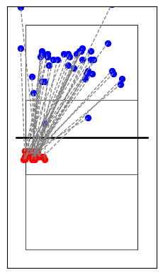

# pydatavolley

A python package for reading volleyball scouting files in DataVolley
format (\*.dvw).

<https://pydatavolley.openvolley.org/>

## Installation

    pip install pydatavolley

## <u>Examples</u>

#### Reading one file:

``` python
# Using read_dv.DataVolley(None) will use example file
import pandas as pd
from datavolley import read_dv
pd.set_option('display.max_rows', 50)
pd.set_option('display.max_columns', 500)
pd.set_option('display.width', 400)
dv_instance = read_dv.DataVolley(None)
df = dv_instance.get_plays()
print(df.head(10))
```

                                   match_id video_file_number video_time                code                      team player_number      player_name player_id      skill evaluation_code setter_position attack_code set_code set_type start_zone end_zone end_subzone num_players_numeric  home_team_score  visiting_team_score home_setter_position visiting_setter_position custom_code home_p1 home_p2  \
    0  6e6d55e3-96b6-4c63-b000-d5bbb7c1794a                 1        494            *P19>LUp  University of Louisville           NaN              NaN       NaN        NaN             NaN               1         NaN      NaN      NaN        NaN      NaN         NaN                 NaN             <NA>                 <NA>                    1                        6        None      19       9   
    1  6e6d55e3-96b6-4c63-b000-d5bbb7c1794a                 1        494             *z1>LUp  University of Louisville           NaN              NaN       NaN        NaN             NaN               1         NaN      NaN      NaN        NaN      NaN         NaN                 NaN             <NA>                 <NA>                    1                        6        None      19       9   
    2  6e6d55e3-96b6-4c63-b000-d5bbb7c1794a                 1        494            aP08>LUp      University of Dayton           NaN              NaN       NaN        NaN             NaN               6         NaN      NaN      NaN        NaN      NaN         NaN                 NaN             <NA>                 <NA>                    1                        6        None      19       9   
    3  6e6d55e3-96b6-4c63-b000-d5bbb7c1794a                 1        494             az6>LUp      University of Dayton           NaN              NaN       NaN        NaN             NaN               6         NaN      NaN      NaN        NaN      NaN         NaN                 NaN             <NA>                 <NA>                    1                        6        None      19       9   
    4  6e6d55e3-96b6-4c63-b000-d5bbb7c1794a                 1        494   *19SM+~~~78A~~~00  University of Louisville            19  Shannon Shields   -296094      Serve               +               1         NaN      NaN      NaN          7        8           A                 NaN                1                    0                    1                        6          00      19       9   
    5  6e6d55e3-96b6-4c63-b000-d5bbb7c1794a                 1        495  a02RM-~~~58AM~~00B      University of Dayton             2    Maura Collins   -230138  Reception               -               6         NaN      NaN      NaN          5        8           A                 NaN                1                    0                    1                        6         00B      19       9   
    6  6e6d55e3-96b6-4c63-b000-d5bbb7c1794a                 1        497   a08ET#~~~~8C~~~00      University of Dayton             8  Brooke Westbeld   -232525        Set               #               6         NaN      NaN        ~        NaN        8           C                 NaN                1                    0                    1                        6          00      19       9   
    7  6e6d55e3-96b6-4c63-b000-d5bbb7c1794a                 1        499  a10AT-X5~46CH2~00F      University of Dayton            10   Jamie Peterson    -11802     Attack               -               6          X5      NaN      NaN          4        6           C                   2                1                    0                    1                        6         00F      19       9   
    8  6e6d55e3-96b6-4c63-b000-d5bbb7c1794a                 1        499   *11BT+~~~~2C~~~00  University of Louisville            11   Anna Stevenson   -278838      Block               +               1         NaN      NaN      NaN        NaN        2           C                 NaN                1                    0                    1                        6          00      19       9   
    9  6e6d55e3-96b6-4c63-b000-d5bbb7c1794a                 1        500  *19DT+~~~42AB~~00B  University of Louisville            19  Shannon Shields   -296094        Dig               +               1         NaN      NaN      NaN          4        2           A                 NaN                1                    0                    1                        6         00B      19       9   

      home_p3 home_p4 home_p5 home_p6 visiting_p1 visiting_p2 visiting_p3 visiting_p4 visiting_p5 visiting_p6  start_coordinate  mid_coordinate  end_coordinate point_phase attack_phase start_coordinate_x start_coordinate_y mid_coordinate_x mid_coordinate_y end_coordinate_x end_coordinate_y set_number                 home_team         visiting_team home_team_id visiting_team_id  \
    0      11      15      10       7           1          16          17          10           6           8              <NA>            <NA>            <NA>   Reception          nan               <NA>               <NA>             <NA>             <NA>             <NA>             <NA>          1  University of Louisville  University of Dayton           17               42   
    1      11      15      10       7           1          16          17          10           6           8              <NA>            <NA>            <NA>   Reception          nan               <NA>               <NA>             <NA>             <NA>             <NA>             <NA>          1  University of Louisville  University of Dayton           17               42   
    2      11      15      10       7           1          16          17          10           6           8              <NA>            <NA>            <NA>   Reception          nan               <NA>               <NA>             <NA>             <NA>             <NA>             <NA>          1  University of Louisville  University of Dayton           17               42   
    3      11      15      10       7           1          16          17          10           6           8              <NA>            <NA>            <NA>   Reception          nan               <NA>               <NA>             <NA>             <NA>             <NA>             <NA>          1  University of Louisville  University of Dayton           17               42   
    4      11      15      10       7           1          16          17          10           6           8               431            <NA>            7642       Serve          nan            1.26875           0.092596             <NA>             <NA>          1.68125         5.425924          1  University of Louisville  University of Dayton           17               42   
    5      11      15      10       7           1          16          17          10           6           8               431            <NA>            7642   Reception          nan            1.26875           0.092596             <NA>             <NA>          1.68125         5.425924          1  University of Louisville  University of Dayton           17               42   
    6      11      15      10       7           1          16          17          10           6           8              3147            <NA>            <NA>   Reception          nan            1.86875           2.092594             <NA>             <NA>             <NA>             <NA>          1  University of Louisville  University of Dayton           17               42   
    7      11      15      10       7           1          16          17          10           6           8              4512            5522            8150   Reception    Reception            0.55625            3.12963          0.93125          3.87037          1.98125         5.796294          1  University of Louisville  University of Dayton           17               42   
    8      11      15      10       7           1          16          17          10           6           8              4578            <NA>            <NA>       Serve          nan            3.03125            3.12963             <NA>             <NA>             <NA>             <NA>          1  University of Louisville  University of Dayton           17               42   
    9      11      15      10       7           1          16          17          10           6           8              4512            5522            5912       Serve          nan            0.55625            3.12963          0.93125          3.87037          0.55625         4.166666          1  University of Louisville  University of Dayton           17               42   

                   point_won_by              serving_team        receiving_team  rally_number  possesion_number  
    0                       NaN                       NaN                   NaN             0                 0  
    1                       NaN                       NaN                   NaN             0                 1  
    2                       NaN                       NaN                   NaN             0                 1  
    3                       NaN                       NaN                   NaN             0                 1  
    4  University of Louisville  University of Louisville  University of Dayton             1                 0  
    5  University of Louisville  University of Louisville  University of Dayton             1                 1  
    6  University of Louisville  University of Louisville  University of Dayton             1                 1  
    7  University of Louisville  University of Louisville  University of Dayton             1                 1  
    8  University of Louisville  University of Louisville  University of Dayton             1                 2  
    9  University of Louisville  University of Louisville  University of Dayton             1                 2  

------------------------------------------------------------------------

#### Reading multiple files - grouping for attacks and kills:

``` python
import pandas as pd
from datavolley import read_dv
import os

# Assign path
dvw_path_folder = os.path.expanduser("~\\desktop\\dvws")
file_extension = ".dvw"

# Get a list of all files with the specified extension in the directory
file_list = [f for f in os.listdir(dvw_path_folder) if f.endswith(file_extension)]

# Initialize an empty DataFrame to store combined data
combined_df = pd.DataFrame()

def process_file(path):
    dv_instance = read_dv.DataVolley(os.path.join(dvw_path_folder, path))
    df = dv_instance.get_plays()
    return df

# Loop through each file path
for file_name in file_list:
    combined_df = pd.concat([combined_df, process_file(file_name)], ignore_index=True)

# Filter for attacks and print attacks 
print(
    combined_df[combined_df['skill'] == 'Attack']
    .groupby(['player_name', 'team'])
    .agg(Att=('skill', 'count'),
         K=('evaluation_code', lambda x: x.eq('#').sum(skipna=True)),
         K_pct=('evaluation_code', lambda x: round((x.eq('#').sum(skipna=True) / x.count()), 3)))
    .reset_index()
    .sort_values(by='K_pct', ascending=False)
    .head(20)
    .reset_index(drop=True)
    .to_string()
)
```

              player_name                                      team  Att   K  K_pct
    0     Breklyn Pulling  California State University, Bakersfield   17  13  0.765
    1       Ally Chandler           University of California, Davis    8   6  0.750
    2       Nicole Briggs                     University of Arizona    5   3  0.600
    3          Kate Hatch             Eastern Washington University    7   4  0.571
    4    Olivia Utterback           University of California, Davis   31  17  0.548
    5    Taylor Underwood                San Diego State University   26  14  0.538
    6       Bailey Ortega                        University of Iowa    2   1  0.500
    7           Ana Heath                     University of Arizona    2   1  0.500
    8        Fatimah Hall                San Diego State University    8   4  0.500
    9            Ava Palm  California State University, Bakersfield   20   9  0.450
    10       Jaelyn Hodge                     University of Arizona   33  14  0.424
    11         Anna Davis                        University of Iowa   19   8  0.421
    12  Delaney McSweeney                        University of Iowa   22   9  0.409
    13    Heipua Tautua'A                San Diego State University   27  11  0.407
    14   Katherine Cooper                San Diego State University   10   4  0.400
    15       Julia Haynie                San Diego State University   15   6  0.400
    16     Allie Caldwell           University of California, Davis    5   2  0.400
    17     Nataly Moravec                        University of Iowa   23   9  0.391
    18      Jordan Wilson                     University of Arizona   31  12  0.387
    19    Bianca Martinez    California State University, Fullerton   21   8  0.381

------------------------------------------------------------------------

#### Plotting attacks -

``` python
# Using read_dv.DataVolley(None) will use example file
import datavolley.pycourt as pycourt
from datavolley import read_dv
import glob
import matplotlib.pyplot as plt
import pandas as pd
dv_instance = read_dv.DataVolley(None)
df = dv_instance.get_plays()
atk_data = df[(df['skill'] == 'Attack') & (df['attack_code'] == 'X5')]
coordainte_df = atk_data[['start_coordinate_x',
                          'start_coordinate_y',
                          'end_coordinate_x',
                          'end_coordinate_y']]

def plot_coordinates(coordinates):
    pycourt.pycourt()

    # Plot the coordinates
    plt.scatter(coordinates['start_coordinate_x'], coordinates['start_coordinate_y'], color='red')
    plt.scatter(coordinates['end_coordinate_x'], coordinates['end_coordinate_y'], color='blue')

    # Connect the coordinates with lines
    for i in range(len(coordinates)):
        start_point = (coordinates['start_coordinate_x'].iloc[i], coordinates['start_coordinate_y'].iloc[i])
        end_point = (coordinates['end_coordinate_x'].iloc[i], coordinates['end_coordinate_y'].iloc[i])
        plt.plot([start_point[0], end_point[0]], [start_point[1], end_point[1]], color='gray', linestyle='--', linewidth=1)

    plt.show(block=True)

plot_coordinates(coordainte_df)
```


